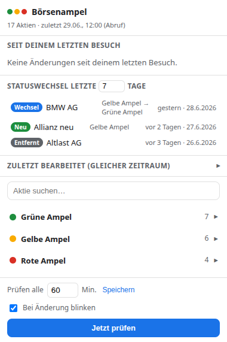
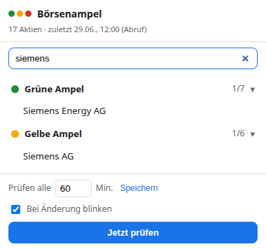
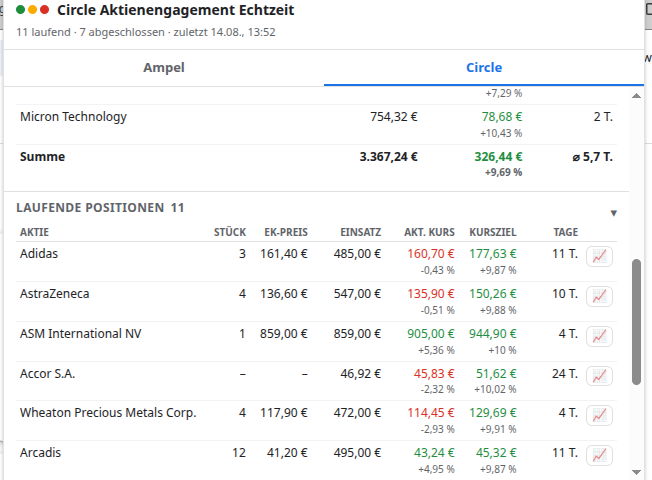
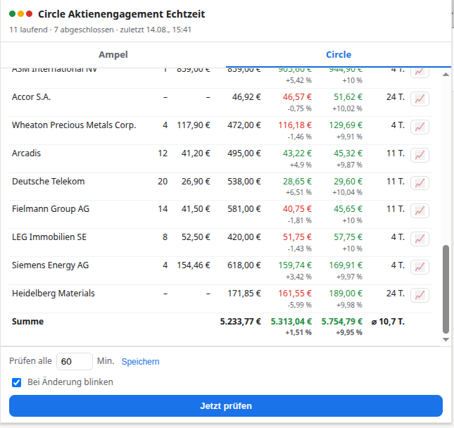
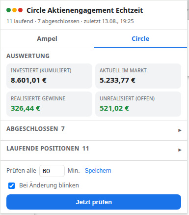
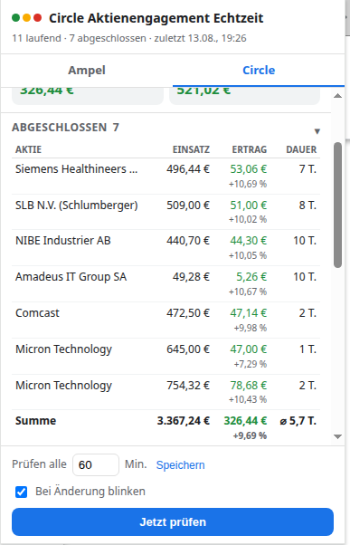

# Börsenampel Watcher

Ein Browser-Add-on, das die **Börsenampel** der [Aktienscout-Community](https://www.skool.com/cybermoney-1123) auf Skool im Auge behält und dir zeigt, **was sich seit deinem letzten Besuch geändert hat** – ohne dass du ständig selbst nachschauen musst. Zusätzlich wertet es die **Aktienengagements** der Community [„Der Circle zur ersten Million"](https://www.skool.com/der-circle-zur-ersten-million-6426) aus (beides unabhängig voneinander nutzbar).

> 👉 **Du bist kein Entwickler?** Dann nimm die **[Anleitung in einfacher Sprache](ANLEITUNG.md)**.
>
> 📱 **Neu – auch als Android-App:** [neueste Version herunterladen](https://github.com/Robbty/Aktienscout-Community-Boersenampel/releases/latest) · **[Installations-Anleitung in einfacher Sprache](ANLEITUNG-APP.md)**

<p align="center">
  
  
</p>

## Was es kann

- 🟢🟡🔴 **Ampel-Übersicht** – grüne, gelbe und rote Ampel mit allen Aktien, aufklappbar.
- 🔎 **Schnellsuche** – Aktie eintippen, Enter springt direkt hin.
- 📄 **Analyse direkt im Add-on** – ein Klick auf eine Aktie zeigt die komplette Analyse (die `[+]`-Punkte, „Fazit", letzte Sichtung) direkt im Popup, ohne Skool öffnen zu müssen. „In Skool öffnen" geht von dort weiterhin mit einem Klick.
- 🆕 **„Seit deinem letzten Besuch"** – neue, gewechselte, entfernte Aktien auf einen Blick.
- 🕒 **Statuswechsel-Logbuch** – eine eigene Historie der Ampel-Wechsel der letzten *X* Tage (die Skool-Seite selbst hat keine Historie).
- 🔔 **Benachrichtigung + blinkendes Symbol**, wenn sich etwas tut.
- 💼 **Circle-Tab** – wertet zusätzlich die Aktienengagements der Community [„Der Circle zur ersten Million"](https://www.skool.com/der-circle-zur-ersten-million-6426) aus: investiertes Kapital (gesamt + aktuell im Markt), realisierte Gewinne und das Potenzial der laufenden Positionen bis zum jeweiligen Kursziel. Die Positions-Tabellen haben ein **Suchfeld** und lassen sich per Klick auf die **Spaltenköpfe sortieren** (zweiter Klick dreht die Richtung; Summenzeilen folgen dem Filter). Braucht nur die Mitgliedschaft **dort** – unabhängig von der Aktienscout-Mitgliedschaft; ohne Zugang zeigt der Tab, wie man beitreten kann.
- 📈 **Aktuelle Kurse & Charts** – die laufenden Circle-Positionen zeigen zusätzlich den aktuellen Börsenkurs (Yahoo Finance, in €, mit Veränderung zum Einkaufspreis in %). Der 📈-Knopf je Position öffnet ein eigenes Chart-Fenster mit frei wählbarem Zeitraum (Auswahl-Leiste), Einkaufs- und Kursziel-Linie.
- 📊 **Kurse auch in der Ampel** – „Kurse laden" in jeder Ampel-Gruppe holt auf Klick (nie automatisch – es sind über 50 Aktien) den aktuellen Kurs in € und die Veränderung zum Vortag in %; der 📈-Knopf je Aktie öffnet den Chart. Börsensymbole werden einmal ermittelt und dauerhaft gemerkt, Kurse 5 Minuten; das Laden läuft parallel und gebündelt, die Zeilen füllen sich nach und nach.
- 📉 **Circle-Gesamtübersicht** – „📈 Verlauf" im Block „Auswertung" zeichnet den Verlauf vom ersten Kauf bis heute: die vier Summen der Auswertung, den Portfolio-Wert zum Tageskurs, den Kapitalbedarf (Untergrenze der Einzahlungen) samt der Annahme „10 Wochen je 1.500 €" und die geschätzten Kosten. Kurven einzeln ein-/ausblendbar, Zeitraum wie bei den Kurs-Charts (zusätzlich „1J").
- 🪟 **Ampel oder Circle als eigenes Fenster** – über „In eigenem Fenster öffnen ↗" (in beiden Tabs) oder beim ersten Chart-Klick verwandelt sich die Ansicht in ein eigenständiges Fenster, das offen bleibt, bis du es schließt. Es zeigt dieselben Daten, aktualisiert sich automatisch mit, und aus ihm heraus öffnen sich weitere Charts direkt im Vordergrund.
- 🟡 **Circle-Meldungen** – bei einem neuen Kauf oder Verkauf gibt es eine Benachrichtigung, ein Logbuch-Eintrag („Käufe & Verkäufe") und einen **goldenen Punkt oben links** auf dem Symbol. So bleiben die Zeichen getrennt und gleichzeitig sichtbar: rote Zahl unten rechts = Ampel-Änderungen, goldener Punkt oben links = Circle-Kauf/-Verkauf, beides zusammen = beides. Der Punkt verschwindet, sobald du den Circle-Tab öffnest.
- 🔒 **Privat** – liest nur deine eigene, eingeloggte Skool-Sitzung; nichts wird irgendwohin gesendet.

### Der Circle-Tab in Bildern

Auswertung mit den vier Summen, dazu die Positions-Listen (auf-/zuklappbar) – laufende Positionen mit Stück, Einkaufspreis, Einsatz, **aktuellem Börsenkurs** (Yahoo Finance, mit % zum Einkauf), Kursziel (aus der Zeile „… Stück zum Kaufpreis: … - Verkaufspreis: …“ des Beitrags: bei „?“ Kaufpreis +10 %, eine konkrete Zahl wird übernommen und bei starker Abweichung vom 10-%-Ziel rot markiert; mit Potenzial in %), Tagen seit Kauf, Summenzeile und 📈-Knopf für das Chart-Fenster; abgeschlossene mit Ertrag, Prozent, Haltedauer und Summenzeile:

<p align="center">
  
  
</p>

<p align="center">
  
  
</p>

*(Die unteren beiden Bilder stammen noch aus einer älteren Version mit schmalerem Fenster.)*

## Voraussetzungen

- Du bist in dem Browser, in dem das Add-on läuft, **bei skool.com angemeldet**. (Die Anmeldung allein genügt – du musst keine der Seiten offen haben.)
- Für den **Ampel-Tab**: VIP-Mitgliedschaft in der [Aktienscout-Community](https://www.skool.com/cybermoney-1123) – **oder** eine Mitgliedschaft in [„Der Circle zur ersten Million"](https://www.skool.com/der-circle-zur-ersten-million-6426), die schaltet die Börsenampel ebenfalls frei.
- Für den **Circle-Tab**: Mitgliedschaft in [„Der Circle zur ersten Million"](https://www.skool.com/der-circle-zur-ersten-million-6426).

Eine passende Mitgliedschaft reicht, um den jeweiligen Teil zu nutzen. Die Kursdaten (Yahoo Finance) brauchen keine Anmeldung; in **Firefox** müssen die Website-Berechtigungen des Add-ons ggf. unter `about:addons` → Berechtigungen erlaubt werden, sonst bleibt die Kurs-Spalte leer. Fehlt der Zugang zu einem Bereich, zeigt dieser Tab bewusst keine Daten, sondern einen Hinweis, wie man beitreten kann; der andere Tab funktioniert normal weiter. Ohne Skool-Anmeldung zeigt das Add-on gar nichts an – deine Daten bleiben geschützt.

## Installation

Lade das Projekt herunter – [**direkt als ZIP**](https://github.com/Robbty/Aktienscout-Community-Boersenampel/archive/refs/heads/main.zip) (oder auf der Projektseite oben rechts über der Dateiliste grüner Knopf **„< > Code" → Download ZIP**), dann entpacken. Oder klone es:

```bash
git clone https://github.com/Robbty/Aktienscout-Community-Boersenampel.git
```

Die fertigen, ladefertigen Ordner liegen unter `dist/`.

**Chrome / Edge / Brave / Opera**
1. `chrome://extensions` öffnen.
2. **Entwicklermodus** einschalten (oben rechts).
3. **„Entpackte Erweiterung laden"** → den Ordner **`dist/chrome`** auswählen.

**Firefox**
1. `about:debugging` öffnen → **„Dieses Firefox"**.
2. **„Temporäres Add-on laden…"** → die Datei **`dist/firefox/manifest.json`** auswählen.

> ℹ️ In Firefox ist das ein *temporäres* Add-on: Es verschwindet beim Schließen des Browsers und muss dann erneut geladen werden. Für eine dauerhafte Installation müsste das Add-on über einen Mozilla-Account signiert werden (`web-ext sign`).

Anschließend auf das Ampel-Symbol klicken und **„Jetzt prüfen"** – der erste Lauf setzt die Vergleichsbasis, ab dann werden Änderungen erkannt.

## Android-App 📱

Die komplette Börsenampel gibt es auch als Android-App (gleiche Oberfläche, gleiche Auswertung): einmal mit dem Skool-Konto anmelden, fertig – auf Wunsch mit **Benachrichtigungen auch bei geschlossener App**. Neue Versionen meldet die App von selbst.

- **Herunterladen:** [neueste Version (APK)](https://github.com/Robbty/Aktienscout-Community-Boersenampel/releases/latest)
- **Schritt-für-Schritt-Anleitung:** [ANLEITUNG-APP.md](ANLEITUNG-APP.md)
- **Technik/Entwickler:** [`app/README.md`](app/README.md) – ein Capacitor-WebView-Wrapper um denselben `extension/`-Code (`cd app && npm install && npm run build && npm run apk`).

## Synchronisation / Schnittstelle zur Trading-App 🔄

Ab 0.7.0 kann die Börsenampel alle Ampel- und Circle-Ereignisse als **Event-Log** in einen Sync-Ordner schreiben, den du selbst besitzt – per **WebDAV** (Nextcloud, kDrive, Filen-Server …) oder in einen **lokalen Ordner**, den dein Cloud-Client synchronisiert (Filen, Proton Drive, Drive …; nur Chrome/Edge am Desktop). Eine Trading-App oder ein eigenes Skript liest daraus den aktuellen Stand; mehrere Geräte gleichen sich über den Ordner ab. Kein Server, keine Konten, keine Analysetexte. Einschalten im Footer des Popups unter „Synchronisation" (Standard: aus). Format, Regeln und Beispiel-Leser: [`EVENTS.md`](EVENTS.md) und `node test/tools/replay.mjs <Sync-Ordner>`.

## Wie es funktioniert (kurz)

Skool ist eine Next.js-App; die komplette Ampel-Struktur steckt als sauberes JSON in der Seite (`__NEXT_DATA__`). Das Add-on liest dieses JSON – einmal pro Abruf im Hintergrund (mit deinen Login-Cookies) und zusätzlich bei jedem echten Seitenbesuch über ein Content-Script. Jede Aktie trägt einen `updatedAt`-Zeitstempel; daraus ergeben sich Wechsel/Neu/Bearbeitet/Entfernt durch Vergleich aufeinanderfolgender Lesungen. Der Analyse-Text einer Aktie wird erst beim Klick nachgeladen (und gecacht, bis sich die Aktie ändert). Der Circle-Tab liest auf demselben Weg die Engagement-Module (Kauf, Verkauf, Stückzahl, Ertrag stehen in den Modul-Texten), holt geänderte Module gezielt einzeln nach und rechnet die Summen lokal zusammen. Die aktuellen Börsenkurse kommen von der (inoffiziellen, kostenlosen) Yahoo-Finance-API: je Position wird einmalig das Yahoo-Symbol über ISIN/WKN/Name gesucht, Kurse werden ein paar Minuten gecacht und Fremdwährungen mit dem FX-Kurs derselben API in Euro umgerechnet – fällt Yahoo aus, zeigt die Spalte einfach „–". Alles wird nur lokal in `storage.local` gehalten.

## Für Entwickler

- **Quellcode:** alles in `extension/` (cross-browser geschrieben, `api = browser || chrome`).
- **Build:** `node build.mjs` erzeugt `dist/chrome` und `dist/firefox` aus `extension/` (nur das Manifest unterscheidet sich je Ziel). Zusätzlich entsteht `dist-test/` (git-ignoriert): eine parallel ladbare Test-Variante, bei der beide Beitritts-Hinweise simuliert werden – siehe Schalter in `extension/lib/debug.js`. Keine Abhängigkeiten, kein Bundler.
- **Tests:** `node test/lifecycle.test.mjs` prüft die Änderungserkennung über den ganzen Ablauf (Login → Bestätigen → Logout → Änderungen → Login) inkl. Logbuch und Begrenzung; `node test/circle.test.mjs` prüft Titel-/Text-Parser und Portfolio-Rechnung des Circle-Tabs gegen alle live gesehenen Schreibweisen; `node test/quotes.test.mjs` prüft die Yahoo-Parser (Chart, Symbolsuche, €-Umrechnung); `node test/events.test.mjs`, `node test/sync-webdav.test.mjs` und `node test/sync-flush.test.mjs` prüfen die Event-Log-Schnittstelle (Format, WebDAV-Adapter, Schreiblauf gegen einen lokalen Mini-WebDAV-Server).
- **Syntax-Check:** `node --check extension/<datei>.js`.
- Mehr zu Architektur und Konventionen: siehe [`CLAUDE.md`](CLAUDE.md).

Nach Codeänderungen `node build.mjs` laufen lassen und die `dist/`-Ordner mit committen, damit die ladefertigen Builds aktuell bleiben.

## Lizenz

[MIT](LICENSE) – frei nutzbar, anpassbar und weiterverteilbar; ohne Gewähr. Einzige Bedingung: Der Lizenztext samt Copyright-Hinweis bleibt enthalten.

---

*Inoffizielles Community-Werkzeug. Steht in keiner Verbindung zu Skool und ist nicht mit den Betreibern der Aktienscout-Community abgestimmt.*
